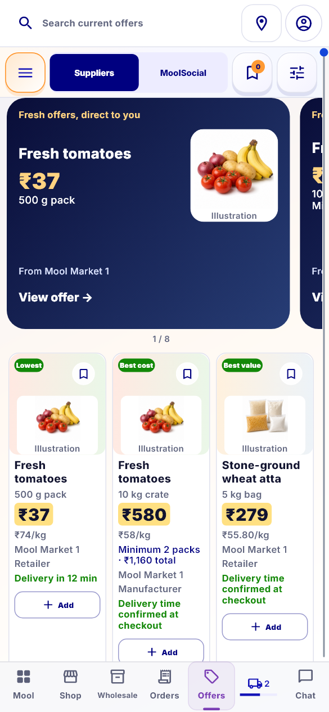
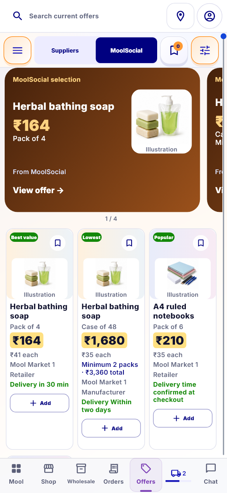

# Offers visual review — OFFERS-01, OFFERS-02, OFFERS-03

The founder approved this scope on 18 September 2026. Implementation is ready for local visual review; this does not mark the new visuals or the device build accepted.

- OFFERS-01: horizontal image-led offer cards with a visible next-card edge; Suppliers and MoolSocial selection, distinct colour treatments, exact publication/product actions and retained selection on Back. MoolSocial selection requests its publisher-filtered feed. Motion is swipe-only. These are image cards; no promotional video playback or new publishing backend is claimed.
- OFFERS-02: consistent image frames on Offers, preserving image aspect ratio and supplier-media validation. The decoded-photo tests caught a 2-pixel Save hit-target overlap after removing variable media stretch. The Offers media inset now reserves the full touch target. This is one occurrence within OFFERS-02, linked to the earlier SKU-M01 media work, not a fourth ticket. Shop and Saved keep their existing layout.
- OFFERS-03: compact Shop-positioned category / publisher selection / Saved / filter toolbar. Category and publisher filters act on existing sources. Saved uses the existing Saved-products sheet.

## Actual local Flutter visuals

These captures use local review fixtures, including an explicit MoolSocial publication fixture. They are not evidence that an administrator has published a real offer.

## Validation

- Combined media, variant, Offers visual and C04/C06/C07 run: 124 passed.
- Paged Offers journeys: 4 passed.
- Source selection / product / Back / category journeys: 4 passed.
- Cart feedback / return: 4 passed.
- Final source-filter and Saved-return rerun: 10 passed (overlaps the above counts).
- Dart analysis: no issues. Source diff whitespace check passed.
- Media coverage includes decoded portrait/landscape/square images, bounded full-image fit, supplier binding, rejected/withdrawn media, fallback presentation, normal/enlarged text, and Save/photo clearance.

Earlier C04/C06/C07 visuals at 73b2cf75 remain founder-approved. The connected device is Redmi 23106RN0DA, currently on Cursor Review r66.28. No new APK was installed during this Offers work. Next: founder visual approval, then the combined Redmi verification and integration.

## Compact card revision requested by founder
Top promotional cards now use 12px padding, a 92px image area, tighter text spacing and a single publisher/action footer. Removed the expanding spacer. Height is calculated from content and grows for enlarged text; the next card still peeks into view. Current review captures: offers-review-compact-v1 (supersedes tall offers-review-final-v2 for visual approval).

Validation after this revision: all 20 selected Offers visual/navigation tests passed; six capture cases passed at 320/390/844 widths and 1x/2x text; catalogue analysis has no issues. Prior broader media and paging results are retained above. Local fixtures illustrate supplier and MoolSocial appearances; no Redmi upgrade or device validation has happened. Founder visual approval is pending.

## Compact revision 2
Founder requested further height and width reduction. Carousel width is now 86% of the viewport (previously 91%); padding 8px, image 72px, headline gap 4px, and smaller title/price typography. Normal review cards are about 153px high, down from 189px. Current captures: offers-review-compact-v2. All 20 selected Offers tests passed; source analysis has no issues. Local visual approval remains pending before Redmi upgrade.
